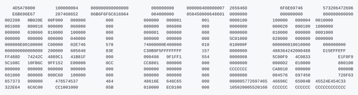

<p align="center">
   
</p>   

AOT Atlas extracts runtime metadata from Windows x64 .NET NativeAOT executables. It is available as a command-line program and a Binary Ninja plugin.

The reader supports AMD64 PE32+ images.  It's able to recover metadata, types, methods, fields, properties, dispatch tables, generic dictionaries, statics, frozen objects, enums, marshalling data, P/Invoke records, native strings, resources, imports, exports, unwind information, exception clauses, and native code references.

Building
--------

This is assumed to be ran on a Windows x64 toolchain to publish the executables.

```
dotnet restore AotAtlas.slnx
dotnet build AotAtlas.slnx -c Release
dotnet publish src/Atlas.Cli/Atlas.Cli.csproj -c Release -r win-x64 --self-contained
```

The CLI program is written to `src/Atlas.Cli/bin/Release/net10.0/win-x64/publish/`

Usage
-----

```
aot-atlas extract program.exe output.json
aot-atlas methods program.exe methods.json
aot-atlas search program.exe results.json "Namespace.Type"
aot-atlas header program.exe types.h
```

Run `aot-atlas` without any args for the command list.  Commands which read reflection maps accept `--map-format legacy` or `--map-format metadata`.  The format is detected automatically when the option is omitted.

Binja
------------

The plugin targets Binary Ninja core ABI 187

```
dotnet publish src/Atlas.Binja/Atlas.Binja.csproj -c Release -r win-x64 --self-contained
```

You can then use it in the GUI via Plugins -> AOT Atlas -> Apply metadata for PE views.

Tests
-----

Almost all tests are made by clankers to double check my work, expect bugs.

See `CONTRIBUTING.md` for dev stuff.
